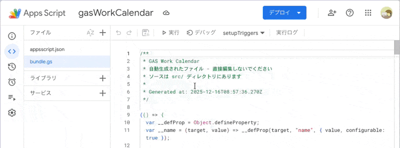

# 🗓️ Gas Work Calendar


[](https://developers.google.com/apps-script)


Google Apps Script (GAS) で **営業日・指定日に基づいて Google カレンダーへ自動的に予定を作成するアプリケーション**です。

- 月初・月末・第N営業日の自動予約
- 定期バッチ（時間トリガー）による自動実行
- clasp対応でローカル管理可能

詳細は [docs/calendar-event.md](docs/calendar-event.md) を参照してください。

## 前提条件

- **Node.js**: v20以上
- **clasp**: グローバルインストール済み
- **Googleアカウント**: Google Apps Script APIが有効化されていること

```bash
# claspのインストール（未インストールの場合）
$ npm install -g @google/clasp

# Google Apps Script APIの有効化
# https://script.google.com/home/usersettings で「Google Apps Script API」をオンにする
```
- 参照: [google/clasp: 🔗 Command Line Apps Script Projects](https://github.com/google/clasp?tab=readme-ov-file#install)

## セットアップ

### 0. リポジトリの取得

GitHub の **Use this template** から自分のリポジトリとして作成できます。

[](https://github.com/shitake4/gas-work-calendar/generate)

または、直接クローンしても利用できます。

```bash
$ git clone https://github.com/shitake4/gas-work-calendar.git
$ cd gas-work-calendar
```

### 1. 依存パッケージのインストール

```bash
$ npm install
```

### 2. ビルド

```bash
$ npm run build
```

`src/` 配下のES Modulesコードから `bundle.gs` が生成されます。

### 3. Google App Scriptsの設定

```bash
# Googleアカウントでログイン
$ clasp login
```

### 4. GASプロジェクトの作成

新規プロジェクトを作成する場合：

```bash
# 新規スタンドアロンスクリプトを作成
$ clasp create --title "Gas Work Calendar" --type standalone
```

既存のプロジェクトに接続する場合：

```bash
# 既存プロジェクトをclone（スクリプトIDはGASエディタのURLから取得）
$ clasp clone <スクリプトID>
```

> **Note**: `.clasp.json` が生成され、`scriptId` が設定されます。

### 5. コードのアップロード

```bash
$ clasp push
```

## 使い方

### 1. 登録する予約を作成

- `src/reservations.config.js.sample` をコピーして `src/reservations.config.js` を作成
- `function getReservations` に登録したい予約を作成

例:
```js
export function getReservations(currentYearMonth, _nextYearMonth) {
    return [
        // ============================================================
        // ここから予約設定を編集してください
        // ============================================================

        {
            type: 'businessDay',
            yearMonth: currentYearMonth,
            businessDayType: 'last',
            allDay: true,
            title: '月末締め作業',
            description: '勤怠締め、経費精算を行う',
        }
```

### 2. Google App Scriptへの反映

```shell
$ npm run build
$ clasp push
```

### 3. トリガーの設定



GAS上で エディタ画面から `setupTriggers()` を選択して手動実行

### 4. 権限の承認

初回実行時にGoogleカレンダーへのアクセス権限の承認が必要です。

## ファイル構成

```
├── docs/
│   └── calendar-event.md            # 詳細ドキュメント
├── scripts/
│   └── build.js                     # ビルドスクリプト
├── src/                             # ソースコード（ES Modules）
│   ├── CalendarEventBasic.js        # 基本的な予定作成
│   ├── CalendarEventBusinessDay.js  # 営業日予定作成
│   ├── CalendarSettings.js          # 設定管理
│   ├── CalendarUtils.js             # ユーティリティ関数
│   ├── CompanyHolidays.js           # 会社休日定義
│   ├── EntryPoint.js                # 予約実行エントリ
│   ├── index.js                     # エントリーポイント（グローバル登録）
│   ├── reservations.config.js        # 予約設定ファイル
│   ├── reservations.config.js.sample # 予約設定ファイルのサンプル
│   ├── TriggerManager.js            # トリガー管理
│   └── TriggerValidation.js         # トリガーバリデーション
├── tests/                           # テストコード
│   ├── mocks/
│   │   └── gas-api.js               # GAS API モック
│   ├── setup.js                     # テストセットアップ
│   └── *.test.js                    # テストファイル
├── bundle.gs                        # 生成されるGASファイル（自動生成）
├── appsscript.json                  # GAS設定
├── package.json
└── vitest.config.js
```

## 開発・テスト

### 環境構築

```bash
$ npm install
```

### ビルド

```bash
# GAS用にバンドル
$ npm run build
```

`src/` 配下のES Modulesコードを `bundle.gs` にバンドルします。
esbuildを使用してIIFE形式で出力し、全関数をグローバルスコープに登録します。

### テストの実行

```bash
# テストを実行
$ npm test

# ウォッチモードでテストを実行（ファイル変更を監視）
$ npm run test:watch

# カバレッジレポート付きでテストを実行
$ npm run test:coverage
```

### 開発フロー

1. `src/` 配下のファイルを編集
2. `npm test` でテスト実行
3. `npm run build` でビルド
4. `clasp push` でGASにアップロード

### テスト構成

- **テストフレームワーク**: Vitest
- **テストファイル**: `tests/` ディレクトリ配下
- **モック**: `tests/mocks/gas-api.js` にGAS固有APIのモックを配置

GAS固有のAPI（`PropertiesService`, `CalendarApp`, `ScriptApp` など）はモック化してNode.js環境でテスト可能です。

### CI

GitHub Actionsでプッシュ・PR時に自動テストが実行されます。

## トラブルシューティング

### `clasp push` しても変更が反映されない

<details>
<summary><b>1. ビルドを忘れていませんか？</b></summary>

`clasp push` の前に必ず `npm run build` を実行してください。

```bash
$ npm run build && clasp push
```

`src/` のファイルを編集しただけでは `bundle.gs` は更新されません。

</details>

<details>
<summary><b>2. GASエディタのキャッシュが残っている</b></summary>

GASエディタを開いている場合、プロジェクト一覧に戻って **ブラウザをリロード**（Ctrl+R / Cmd+R）してください。
エディタはキャッシュを保持するため、`clasp push` 後も古いコードが表示されることがあります。

</details>

<details>
<summary><b>3. 正しいプロジェクトにpushしていますか？</b></summary>

`.clasp.json` の `scriptId` が正しいか確認してください。

```bash
$ cat .clasp.json
```

GASエディタのURL `https://script.google.com/d/<scriptId>/edit` と一致しているか確認します。

</details>

## License

Gas Work Calendar is released under the MIT License. See the [LICENSE](LICENSE) file for details.
